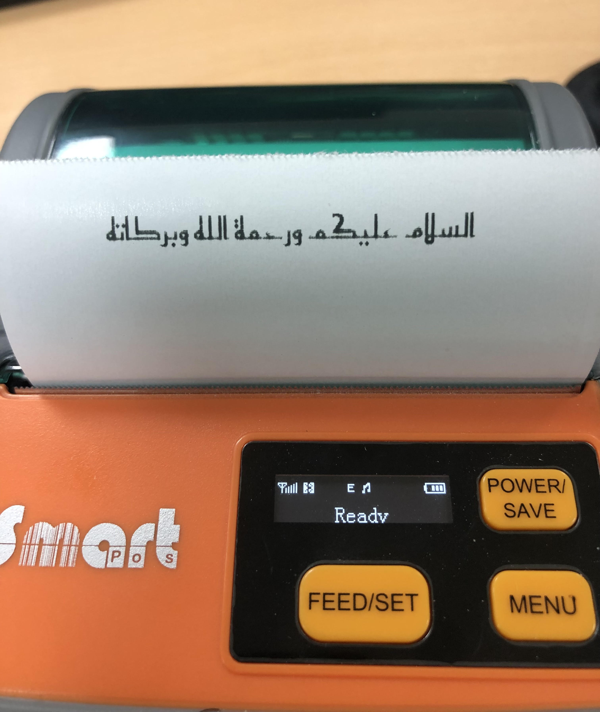

# AndroidPosBluetoothPrinter
A simple project that makes printing via bluetooth printers easier, it supports multilingual text printing like Arabic ❤, you can adapt this code easly to any programming language or platform.

 Add the zxing library as a dependency to generate barcode, as shown here :

```
  implementation 'com.google.zxing:core:3.4.0'
 ```

## Usage

```java
 public void test(Context context) {
        BluetoothAdapter btAdapter = BluetoothAdapter.getDefaultAdapter();
        BluetoothDevice mBtDevice = btAdapter.getBondedDevices().iterator().next();   // Get first paired device
        final PosBluetoothPrinter mPrinter = new PosBluetoothPrinter(mBtDevice);
        mPrinter.connectPrinter(new PosBluetoothPrinter.PrinterConnectListener() {

            @Override
            public void onConnected() {
                Typeface typeface = Typeface.createFromAsset(context.getAssets(), "fonts/reem_kufi.ttf");
                mPrinter.setAlign(PosBluetoothPrinter.ALIGN_CENTER);
                mPrinter.printMultiLangText("السلام عليكم ورحمة الله وبركاته", Paint.Align.CENTER, 32, typeface);
                mPrinter.feedPaper();
            }

            @Override
            public void onFailed() {

            }


        });
    }
```
## Result

